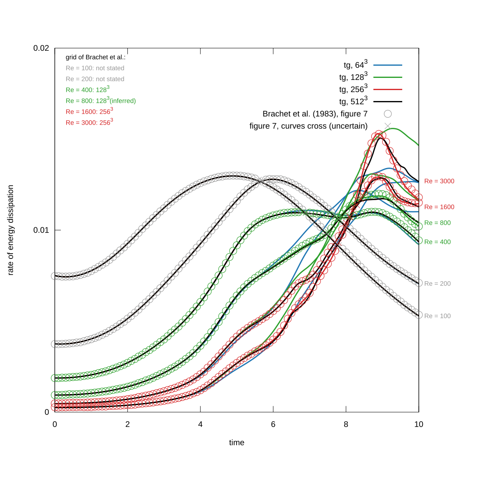
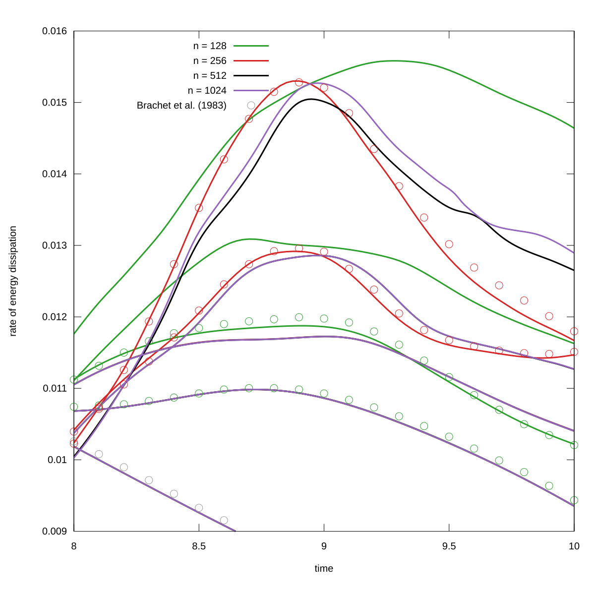

<h2>Build</h2>

Pseudo-spectral solvers for incompressible flow in a periodic box:
`fourier.c` (complex Fourier series, RK4) and `tg.c` (the Taylor-Green
vortex in the symmetric representation of Brachet et al., leapfrog
and Crank-Nicolson). Both print step, time, energy, and enstrophy.
Needs FFTW 3.3.9 or newer.
<pre>
$ make
$ ./tgv.py -l 6 -o tgv.raw
$ ./fourier -i tgv.raw -t 10 -n 0.01 -s 0.01
$ ./tg -M 32 -t 10 -n 0.01 -s 0.01
</pre>

```
Usage: fourier [-v] [-d] -i <input.raw> -n <viscosity> -t <end time> -s <time step>
Usage: tg -M <modes> -n <viscosity> -t <end time> -s <time step> [-e <spectrum interval>]
```

`tg -M 128` runs on a 256^3 grid.

<h3>Validation</h2>

<p align="center"></p>
Figure: Energy dissipation rate vs. time for the Taylor-Green vortex,
`tg` on n^3 grids (lines, `data/tg/<n>/<Re>`), and figure 7 of
Brachet et al. (circles, `img/ref.txt`). From top to bottom at time =
0: Re = 100, 200, 400, 800, 1600, 3000. The circles have the colour of
the grid used in the paper, grey where it is not stated.

<p align="center"></p>
Figure: The same, time = 8..10.

<h2>References</h2>

- Brachet, M. E., Meiron, D. I., Orszag, S. A., Nickel, B. G., Morf,
  R. H., & Frisch, U. (1983). Small-scale structure of the
  Taylor-Green vortex. Journal of Fluid Mechanics, 130, 411-452.

- Orszag, S. A., & Patterson Jr, G. S. (1972). Numerical simulation of
  three-dimensional homogeneous isotropic turbulence. Physical review
  letters, 28(2), 76.

- Mortensen, M. (2016). Massively parallel implementation in Python of
  a pseudo-spectral DNS code for turbulent flows. arXiv preprint
  arXiv:1607.00850.
